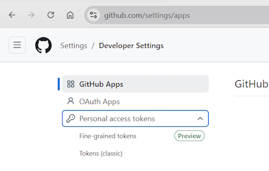

# Git Authentication

Authentication isn't required for public repositories but if I want to clone a private repository I have to use a method of authentication.

## Personal Access Tokens (PATs)

Since August 2021 you can't authenticate using a username and password. The simplest form of authentication is private access tokens that you can create on Github.

### Creating a Personal Access Token

Login to your Github account.

Click on your profile picture.

On the left hand side of the page at the bottom is the option to select **Developer settings**.

Once again on the left hand side select, **Personal access tokens**. From the list select, **Tokens (classic)**.

Generate a New SSH Key and Add it to your GitHub
https://www.youtube.com/watch?v=X40b9x9BFGo

Mastering Git Authentication Methods (my notes are based on this.)
https://www.youtube.com/watch?v=C7V6ExhtIkc

How to Add Passkey on Github - Full Guide
https://www.youtube.com/watch?v=FlbYeI16C7s

What is a Passkey?
https://www.youtube.com/watch?v=6lBixL_qpro

Understand passkeys in 4 minutes
Chrome for Developers
https://www.youtube.com/watch?v=2xdV-xut7EQ
