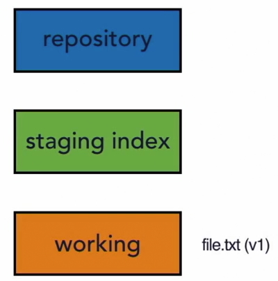
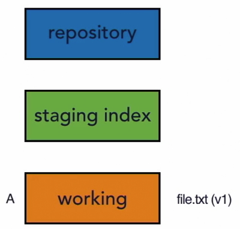
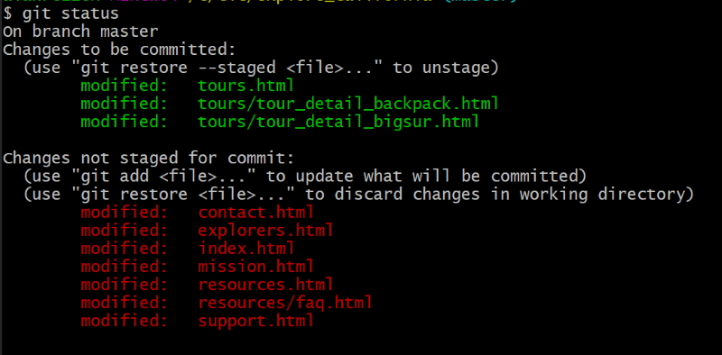
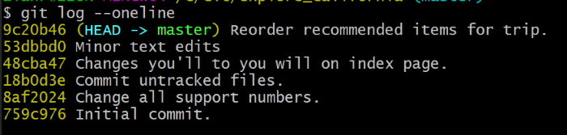
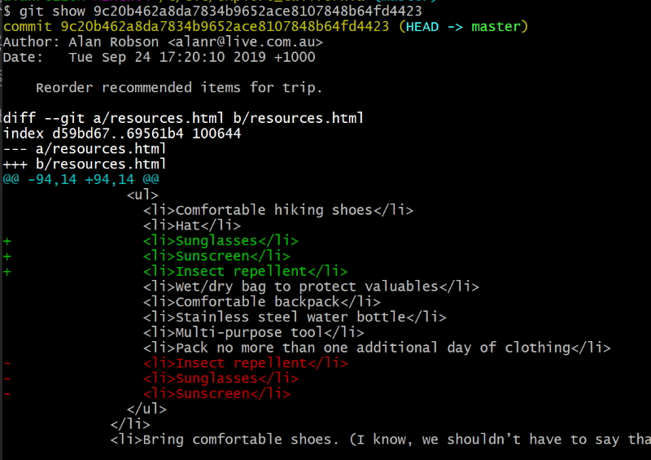
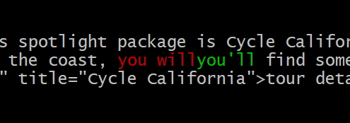
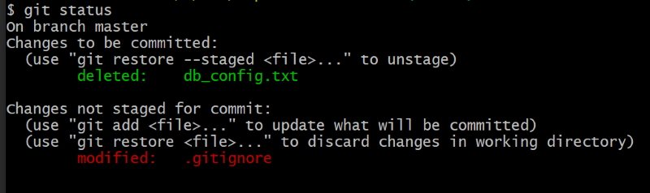

# Using Git

Check the version of Git you are currently using.

```bash
	git --version
```

## Update Git

```bash
	git update-git-for-windows
```

Git changes the path to add the following variables.

```bash
	C:\Program Files\Git\cmd;

	C:\Program Files\Git\mingw64\bin;

	C:\Program Files\Git\usr\bin;
```

Git creates a  config file in your users directory. Mine is C:\Users\alanr

```bash
	cat .gitconfig
```
.

```bash
	[user]
        name = Alan Robson
        email = alanr@live.com.au
```

You can also have a project level configuration file.

```bash
	my_project/.git/config
```

You can make configuration changes on the following levels.

#### System

```bash
	git config --system
```

#### User

```bash
	git config --global
```

#### Project	

```bash
	git config
```

### Changing settings

You can change settings with the following commands.

```bash
	git config --global user.name "Alan Robson"

	git config --global user.email "alanr@live.com.au"
```

Check your configuration.

```bash
	git config --list
```

Check an individual setting.

```bash
	git config user.name
```

Change individual settings.

```bash
	git config --global core.editor "C:\\Program Files\\Microsoft VS Code\\Code.exe --wait"

	git config --global color.ui true
```

## Git Help

```bash
	git help

	git help log
```

### Change drives in Git bash

```bash
	cd /D/Projects/Dirb
```

## Distributed Version Conrol

Different users maintain their own repositories. (no central repository)

The changes are stored as **change sets** or **patches**.

We are tracking changes, not the versions of the document.

Change sets can be exchanged between repositories.

So you can "merge in changes sets" or "apply patches" between the different repositories.

No single master repository.

Many working copies each with their own combination of change sets.

These can then be merged at a later time or submitted for inclusion to the master copy.

## Getting Started with Git

In your projects directory create a new directory, e.g. Git-Docs.

cd into your new directory.

```bash
	cd /C/Git/Git-Docs
```

Now initialise the directory

```bash
	git init
```

You get the message.

```bash
	Initialized empty Git repository in C:/Git/Git-Docs/.git/
```

This creates a hidden directory.

```bash
	.git
```

This is where Git tracks its changes.

There is a configuration file,

```bash
	cat .git/config
```

This is user level configuration. This is also where the project configuration resides as well.

The rest of the **.git** directory you should leave alone and let Git handle it.

If you remove the **.git** directory you will remove all of the tracking for this project. Git centalises everything in this one directory.

I can now add files into my directory.

I can track the status of the project by.

```bash
	git status
```

This will tell me that I have no commits yet and one untracked file.

I can now tell Git that I want to track the change and we can do that by.

```bash
	git add .
```

``.`` is shorthand for all the files in the current directory.

Once we have done this we have told Git to do this we aren't tracking the changes and to make the changes permanent we need to commit them.

```bash
	git commit -m "Initial commit."
```

This is the process we are going to follow for every job we do.

### Your first commit

* Make changes.
* Add the changes.
* Commit changes to the repository with a message.

We are going to do these three steps over and over again.

If I do a *git status* after I make some changes to the file I added it will tell me that the changes are not committed.

## Writing good Commit messages

A short single-line summary of what the changes are (less than 50 characters).

You can write multi-line commits as well by adding a blank line for a more complete description.

Keep each line to less than 72 characters.

Write commit messages in present tense not past tense.

"Fixes a bug" or "Fix a bug" not "Fixed a bug".

The change message describes *what is in* a change set.

Bullet points are usually asterisks or hyphens. Can add "tracking numbers" from bug or support requests.

You can add the type of files that were changed in a shorthand [ccs, js] at the start of the message or the tracking number.

Make sure your messages are clear and descriptive.

## View the Commit log

```bash
	git log
```

Will show me a list of commits made for each project with the newest entry at the top.

> commit 5e8ac3e4e470e43dc17ad181bca04183d6f805d6 (HEAD -> master)		
> Author: Alan Robson <alanr@live.com.au>		
> Date:   Sun Sep 22 12:43:54 2019 +1000		
> 		
> 		Initial commit.		
>

Information in the message includes the sha value which is a unique key we can use to identify each commit. It shows me the author details and date of commit and gives me the message for the commit.

There are some other options in the *git log* command.

```bash
	git log -n 5
```

Limits the number of commits to 5.

```bash
	git log --since 2019-01-01
```

Shows me the commits since the start of this year.

```bash
	git log --author="Alan"
```

I don't have to type in the full name.

```bash
	git log --grep="Init"
```

or

```bash
	git log --grep="[Ii]nit"
```

This would be handy for bug fixes if you had referenced that in your commits.

## Setting up Github

I am using Azure DevOps because it keeps my Git projects private.

I create a new repo and give it the same name as my local repository.

My repository will be named ``Git-Docs``.

I will get a set of commands that I can use to link my local repository to my Azure repository.

First make sure that you don't already have a remote repository.

```bash
	git remote -v
```

If you don't have a remote repository you can now create one.

```BASH
	git remote add origin https://alanr.visualstudio.com/Git-Docs/_git/Git-Docs
```

I can then push to the remote server.

```bash
	git push -u origin --all
```

This will push all of my files up to the remote Azure server.

## Git Concepts and Architecture

The usual structure for a version control system is a two tree structure.


The repository has a set of files. We then checkout those files to our working directory. At this stage they are the same.

When we finish doing changes in our working directory we commit those files back to the repository. We have two distinct trees.

Imagine that I have added information into my working files but haven't committed them back to the repository. Both sets of files are saved but in different states.

### The Three Trees

Git uses a three tree structure. It still has the repository and the working copy but also has a staging index tree in between the other two trees.


We have to save our files twice in a two-step process.

The first save is **add** to the staging index and then we **commit** to the repository.

We can skip the **add** step and commit directly to the repository. We will see this later but you should imagine a two-step procedure.

The reason for this is that we can have a number of changes to files in our working directory but only want to commit some of those to the repository. The three tree structure allows us to do this. We add the changes we want to the staging and get them ready before we commit them.

We can also go the other way. Pull them from the repository to the staging and then move them to the working but this isn't something we would usually do.

Usually we would pull from the repository directly to the working tree. In the process staging will be updated as well.

As you are working with Git it is worthwhile keeping these three trees in mind.

There is your working directory that has changes that might not be tracked by Git yet.

Then there is the staging index the contains changes that we are about to commit to the repository.

Finally there is the repository that is being tracked by Git. The changes that Git has and that it is going to keep hold of and keep track of.

### Git Workflow

We will discuss a simple file and watch how it changes and is uploaded to the repository.



We have a file that is version 1 in our working directory. We call these changes ``A``.



So at present it is in our working directory not our staging or our repository.

```bash
	git add file.txt
```

Will add our file to the staging index.

**Note:** We can *add* all files with a ``.`` or add multiple files in one commit.

```bash
	git add file1.txt file2.txt
```

We can also add a directory of files.

```BASH
	git add tours/
```

Will save all files in the tours directory.


Note: that at the moment we are just specifying a single file to be added.

We now use.

```bash
	git commit
```

(we would add a message at this stage)

This pushes that changeset into the repository.


So now we have the same file (changeset) in our working staging and repository.

Now imagine we are going to make changes to that file. So now we have version 2. We can refer to this changeset as B.


We then use ``git add file.txt`` again to add the changeset to the staging index and the ``git commit`` to add the changeset to the repository.


Now the repository has two sets of changes in it (set A and set B).

You could keep adding to this.


Now you can use ``git log`` to view those three commits (A,B, and C) to see what changed between each one. Of course Git doesn't refer to them as A,B and C but has a unique ID number that it applies to each changeset.

### More on workflow

Now that we have added a remote repository there is an extra step in our process before we can upload files to all repositories. Carry out these steps

```bash
	git status
```

If there are unmodified files then you need to do this.

```bash
	git add .
```

This will upload all changeset files to staging index.

```bash
	git commit -m "Added workflow notes"
```

Will commit the files to the local repository.

At this stage all files are in the same state.

Do a ``git status`` to make sure that nothing is modified and if so then push the latest files to the Azure repository.

```bash
	git push -u origin --all
```

or now that the remote files have been initially pushed you can use this command.

```bash
	git push
```

After this all files in the local and remote repositories are in the same state. Run a ``git status`` and you should receive this message.

> On branch master		
> Your branch is up to date with 'origin/master'.		
> 		
> nothing to commit, working tree clean

### Hash values (SHA-1)

So far we have only worked with one file but usually it will be multiple files and directories and when we save it will a snapshot of all of those files in a changeset. We called the changesets A, B and C for simplicity but that is not how Git refers to them. Git generates a checksum for each changeset that is a hash value.

A checksum is a number that is calculated by taking the data and feeding it into a mathematical algorithm.

An important point to note is that the same data always equals the same checksum so it always returns the same results. That is why we call it a checksum because we can always check it and it will be the same. It is used to guarantee data integrity.

Data integrity is a fundamental that is built into Git.

The checksum that Git creates is tied to the data in that changeset. If you were to change that data then the label or hash value (checksum) would change. So each value is unique and directly tied to the contents inside of it.

Git uses the SHA-1 algorithm to create checksums. People refer to this as the sha value or s.h.a. value.

So if someone refers to the sha value of that commit they are talking about the checksum, the hash value that is used to refer to the value used to label the commit.

The number generated is a 40 character hexadecimal string.

> e.g. 94add12382d84b06472ba89d336c104cb646823a

Not only does Git do that with our changeset it also does something else that is important for data integrity. In addition to using the code that is in one of our snapshots it also uses the metadata as well. That means that you can't change the commit message or the commit author or the **parent** of the commit without also changing its sha value. That gives us a nice chain of data integrity because when it goes to create snapshot A it takes all of its data to create a sha value. When it goes to snapshot B is also goes through the same process and generates a sha value but it includes the snapshot value from A so it is linked to A. If something changes in A the checksum changes and it won't point to B anymore. 

So not only is there data integrity but there is also a history of changesets and how they relate to each other.


### The HEAD value

Git contains a reference variable called **HEAD**. We call this variable a pointer and its purpose is to point to or reference a specific commit in the repository.

* Pointer to tip to the current branch (commit) in the repository.
* Last state of repository, what was last checked out.
* Points to parent of next commit where writing commits take place.

As we make new commits the pointer changes or moves to point to a new commit. The HEAD always refers to the tip or the current branch in our repository. It has nothing to do with the staging index or the working repository. We are tracking the current position in the repository. Imagine a cassette recorder whose head moves to where the recording has stopped. When the recording starts again the head moves to the next stop.

The HEAD pointer in Git is very similar it points to the place where we are going to start recording next. It's the place where we left off in our repository with what we've committed.

To show how the HEAD works we will take the sha values from the previous diagram that shows our series of commits.


The HEAD points to the tip of our current branch in our repository.

It is the parent of the next commit we make so when we make our next commit is will be attached to the end next to ``a614b5`` that will become the parent. The HEAD becomes especially important when we start talking about branches.

The branch we are working on is called the master branch and that is our main branch.


We can create a new branch and the HEAD will move to that branch.


We can move the HEAD between the two branches. Git moves the HEAD for us we don't have to be concerned with that.

For our repository we can see where the HEAD exists.

```bash
	ls -la .git
```

You will see that there is a file named HEAD.

> cat .git/HEAD		
> 	ref: refs/heads/master

This is telling us that we can find this information in the refs director

> cat .git/refs/heads/master		
> 938a47605721089babf0b4dfd7890fae7b91ac29

> git log		
> commit 938a47605721089babf0b4dfd7890fae7b91ac29 (HEAD -> master, origin/master)		
> Author: Alan Robson <alanr@live.com.au>		
> Date:   Sun Sep 22 17:31:59 2019 +1000		
>		
>    Added more workflow notes.

Note that ``git log`` will shows the commits and the latest sha value is the same as the one in `.git/refs/heads/master`

The log also tells us that the sha value is the HEAD -> master.

Git will move the head for us in most cases so we do not need to be aware of this but it is useful to understand the concept and what Git is doing for us.

## Make changes to files

### Add files

When you have committed your files you do a ``git status`` it will tell you that there is nothing to commit and your working tree is clean.

If you add new files to you directory and do another ``git status`` you will get a different message. On branch master you have untracked files and a list of the files that aren't being tracked. There is also a message that you can use ``git add`` to track these files.

If we make any changes to these files before we do the ``git add`` process then these changes won't be tracked. So in this case you won't have a record of what has changed.

Doing a ``git add`` will move the files into the staging tree.

You cna move all files with a ``.`` or name each file to be added. Say we had two files to add, second_file.txt and third_file.txt.

We will only add one file, second_file.txt.

Now do a ``git status`` again and you will see the following message.


It will tell you that you have one file to be committed (unstaged) and one file to add (untracked).

We can commit our one staging file by.

```bash
	git commit -m "Add second file to project."
```

Do a ``git log`` and you will see that there is a new sha value and that the HEAD has moved.

Now you can ``git add third_file`` to move the untracked file to staging and then do a ``git commit -m "Add third file to project"``.

``git log`` will tell you that the third_file.txt was committed (the HEAD will have moved) and a ``git status`` will tell you that there is nothing else to do.

### View changes with ``diff``

This allows us to see changes in our working directory.

```BASH
	git diff
```

> diff --git a/UsingGit.md b/UsingGit.md		
> index dc92054..6e7d904 100644		
> --- a/UsingGit.md		
> +++ b/UsingGit.md

File **a** is in my repository and file **b** is in my working directory. The list has a number of ``+`` lines which have been added to my working file. They are also coloured green.

The ``-`` will tell you a line has been changed or removed.

**Note:** We can do a *diff* on a particular file in the changeset.

```bash
	git diff file.txt
```

### View only staged changes

```bash
	git diff --staged
```

This will show us the differences between the staging area and the repository.

```bash
	git diff --cached
```

Is exactly the same thing as ``--staged``. cached is an alias but it is preferable to use staged.

### Deleting files

You have to tell Git that you want to delete files that you have committed. 

First add a couple of files to your project to delete.

file-delete1.txt

file-delete2.txt

Commit these new files to your repositories.

There are two ways to delete files from your project.

The first technique is to just delete the file from the directory. We will delete file 1.

``git status`` will give you the message.

> Changes not staged for commit:	
>  (use "git add/rm <file>..." to update what will be committed)	
>  (use "git restore <file>..." to discard changes in working directory)	
>        deleted:    file-delete1.txt

It tells you that you have deleted a file.

Now to remove it from Git.

```bash
	git rm file-delete1.txt
```

it will give you this message. It tells you that it has removed the file from the repository.

> rm 'file-delete1.txt'

``git status`` tells us that the file is now in the staging area.

> Changes to be committed:		
>  (use "git restore --staged <file>..." to unstage)		
>        deleted:    file-delete1.txt

Now to get rid of it from staging.

```bash
	git commit -m "Delete first file."
```

You get this message.

> git commit -m "Delete first file."		
> [master 6f42ee0] Delete first file.		
> 	1 file changed, 1 deletion(-)		
>   delete mode 100644 file-delete1.txt

The second technique to remove a file is to tell Git to remove it.

```bash
	git rm file-delete2.txt
```

You will get a message saying that Git has removed the file. If you look in your directory you will see that it has gone. It is a Unix command that has removed the file and you will notice that it isn't in your recycle bin as well.

It is still in the repository so we could get a copy from there if we needed it.

``git status`` tells you that the file 2 is in the staging directory.

This is a step shorter than the first technique as Git deletes the file for you and adds it to the staging directory.

```bash
	git commit -m "Delete second file."
```

``git status`` should report that there is nothing to do.

### Move and rename files

There are two techniques to move or rename files.

The first is to rename the file in my directory.

``git status`` tells me that there are two files changed.


The original filename has been deleted and the renamed file isn't being tracked. It is listing them as two separate events.

So now you have two steps to do.

```bash
	git add primary_file.txt
	git rm first_file.txt
```


Git now recognises that we have renamed the file. It doesn't pick up on it initially but it does pick it up in staging.

The next technique for renaming a file is to **move** it.

```bash
	git mv second_file.txt secondary_file.txt
```

The file name has been changed in our directory and ``git status`` tells us that the file has been added to our staging area and that we have renamed the file.


The second technique is a little more efficient.

Now we can add a new directory into our project and then move a file from the root into the new directory.

The file will be flagged as deleted and the new directory will be flagged as a new file that is untracked.

Now in the directory shift the file back into the root and run this command.

```bash
	git mv third_file.txt first_directory/third_file.txt
```


This is more efficient as it puts all the changes into staging. It has also moved the file.

Now wrap up by committing the changes.

### Diff options

```bash
	git diff
```

This will fold (wrap) the text in bash. If you don't want to fold text.

```bash
	-S
```

To wrap again just do another -S.

> b - to move back in the diff (or the Up arrow)		
>		
> f - to move forward in the diff (or the Down arrow)

Diff will show the whole line of text that contains the change. If you only want to show the text is old and new.

```bash
	git diff --color-words
```

This will highlight only the changed text in colour.

To compare two commits.

```bash
	git diff 12ac456..a234d4c6
```

Where the first sha value is the oldest and the next sha value is later.

or

```bash
	git diff 12ac456..HEAD
```

Where the first value is the older sha value and the next is the latest (HEAD) value.

You can also select a changeset (commit) to view.

```bash
	git show 5337a16679e8a200d57354444fa84a95d3658f50
```

Once again you could also add ``--color-words`` to this line

```bash
	git show 5337a16679e8a200d57354444fa84a95d3658f50 --color-words
```

### Commit in one step

You can bypass the ``add`` to staging step.

```bash
	git commit -am "Fixes blah, blah."
```

Note: There are two important caveats.

* Stages and commits all changes to *tracked* files.
* Does not includes untracked files.

You can also commit with a multiple line message.

```bash
	git commit -a
```

This will stop and wait for you to add a multiple line comment in your text editor.


Once you have saved and closed the commit message editor window in your text editor you will go back to bash and see the final message letting you know that you have committed your changeset.


### Log options

You can limit the number of commits you see in the log.

```bash
	git log -n1
```

This limits to the latest commit.

To only see the first line of each commit.

```bash
	git log --oneline
```

This will show you a one line message for each commit.

## Using Git in a real project

We are using Git for the Explore California website project. We open the directory in the directory structure where we keep our projects.

If you run ``git status`` in the directory you will get a message stating that the directory is not a Git repository. This means that if we want Git to track our files we need to initialise the directory.

```bash
	git init
```

Now if you do an ``ls -la`` you will see that we have a **.git** directory in our directory. This shows us that Git has been added. If we do a ``git status`` now we will see that we have untracked files.

If you do a ``git log`` you will get an error because the HEAD is not pointed at anything meaning that we haven't committed yet.

So now we do a commit.

```bash
	git commit -m "Initial commit."
```

This adds all of the files to our repository.

```bash
	git log
```

Will show our first commit.

Note that each directory in your working directory that has a **.git** directory in it is a separate Git repository.

### Making atomic commits

These are small commits and are a best practice.

* Only affect a single aspect.
* Easier to understand when we work with them and to find bugs inside of them.

Makes it easier to work when you collaborate with other people.

## Undo Changes

### Undo working directory changes

In this case we are going to delete the navigation from the Index.html file. We have closed our text editor and saved file changes to the working directory.

We then realise that we didn't really mean to make these changes and we can't use the editor to undo the changes.

We still have a copy of the original file in Git's repository so we can bring it back with the following command.

```bash
	git checkout -- index.html
```

The double dash **--** is telling Git that we want to checkout from the current branch.

Once we do this it will return the copy of *index.html* from the repository and place it in or working directory.

```bash
	git status
```

Tells us that there is nothing to do.

If you look at *index.html* you will see that it is back to its original state.

### Unstage files

We will do a global search for $150 and replace that price with $175. This will do 11 changes across 10 files.

``git status`` tells us that we have a number of files to update. We will only update the files in the tours directory.

```bash
	git add tours*
```



Say we decide to unstage the tours files we can do this by

```bash
	git reset HEAD tours*
```

This will remove the tours files from the staging tree.


Now let's revert the files back to the way they were before we did the changes.

```bash
	git checkout -- .
```

``git status`` and a check of the files will tell us that we are back to the unchanged state.

### Amending commits

We are going to amend commits that are already in the repository.

Remember that we can't change any of the old commits without breaking the chain. There is one set of commits that we can change and that is the current (HEAD) commit.

We are going to change the resource.html file. Change the order of sunglasses and sunscreen. We will place them under hat. ``git diff`` will show us what has changed.

```bash
	git commit -am "Changed items to bring."
```

``git status`` shows us there is nothing to do and ``git diff -n1`` shows us the current commit with the message "Changed items to bring.".

Now we realise that we needed to shift insect repellant up with the other changes we made in the current commit. Let's do this. 

``git diff`` shows us what has changed and we want to amend this to the previous (HEAD) commit.

first,

```bash
	git add resources.html
```

``get status`` will show us that it is now staged.

Do a ``git log --oneline``.


If we want log1 to the previous commit.

```bash
	git commit --amend -m "Reorder recommended items for trip."
```

Now do another ``git log --oneline``.



Notice that the comment in the previous commit has been changed to the new amended message. Also notice that the sha has changed because the files have been changed.

If we do a ``git show``.

> git show 9c20b462a8da7834b9652ace8107848b64fd4423

We can see that we have all of the changes.



Now we have decided that we want to amend the message for the previous commit.

```bash
	git commit --amend -m "Reorder recommended items for outdoor trip."
```

``git log -n1`` will show us that the message has been amended. Note also that the sha value changed even though all I changed was the message.

### Retrieve old versions of files

Git only allows amending the most recent commit otherwise we wouldn't be able to verify the chain of integrity.

Edits which undergo changes should be new commits.

It maybe helpful to retrieve an old version of a file.

We did a small change to the *index.html* file. Do a ``git log -n1`` to try and find the commit where we changed *index.html*.


It has a sha value of 48cba47.

```bash
	git show 48cba47 --color-words
```

Will show you where the change occurred but we really want the commit before that which has a sha value of 18b0d3e.

I want the *index.html* page from that commit.

```bash
	git checkout 18b0d3e -- index.html
```

``git status`` will show that file in the staging directory. So now I can do a,

```bash
	git diff --staged
```



The text in red (you'll) is what was the old version and the green (you will) is what is in the staging file and the working directory so we have reverted back to the old version of the file.

Looking at the index page you will see that the text has reverted back to the original "you'll" text.

do a ``git diff --staged --color-words`` and you will see that the change is in the staging directory.

Now we can commit that change and we will have both changes committed.

```bash
	git commit index.html -m "Revert back to original text."
```

``git log`` will show that we have both commits.

### Revert a commit

Reverting a commit is to just undo that commit.

We have decided that we were wrong to make the last change so we want to revert that change (revert the commit).

We can do this because the commit is the last commit and we won't upset the chain if we change the last commit.

We are going to make a commit that reverses the last commit. There is an even easier way than the way we did it previously.

Do a ``git log -n1`` to get the sha value of the last commit. 5e3ad0f185cc

now revert by.

```bash
	git revert 5e3ad0f185cc
```

This will open your editor with a message about reverting. You can add extra text if you want but if not jst save and close. Now check the logs again and you will see the latest commit has the message about reverting.


You will see the HEAD message,

> Revert "Revert back to original text."		
>		
> This reverts commit 5e3ad0f185cc422360de01c300e3b30bf87cab32.

It tells you that you have reverted the previous commit and the sha value of the previous commit is there for reference.

```bash
	git show HEAD --color-words
```

Will show you the latest changes and a quick look at the index page shows that you have reverted back to the original text.

``git show HEAD`` is a good way to look at the latest commit changes.

### Removing untracked files

We occasionally have untracked files that we don't really need in our project. There is an easy way to remove these using Git rather than deleting them manually.

Imaging we have three text files in our project - junk1.txt, junk2.txt and junk3.txt.

``git status`` tells us that we have three untracked files ready to be added.

```bash
	git clean -n
```

Warns us about what can be removed. This is a dry run, a safety net. The message we receive is.

> Would remove junk1.txt		
> Would remove junk2.txt		
> Would remove junk3.txt

Let's add *junk1.txt* to staging.

```bash
	git add junk1.txt
```

Run ``git clean -n`` again and it tells us.

> Would remove junk2.txt		
> Would remove junk3.txt

*junk1.txt* is in the staging area so won't be removed. It is only removing untracked files, not files in the staging tree or repository. It is only removing files in my working directory.

```bash
	git clean -f
```

 This is the message we receive.
``-f`` is the force removal of items. It will totally remove these files. This is the message we receive.

> Removing junk2.txt
> Removing junk3.txt

If I do a ``git status`` it will tell me that *junk1.txt* is in the staging tree.

```bash
	git reset HEAD junk1.txt
```

Will remove it from the staging tree and then we can remove it by.

```bash
	git clean -f
```

This will remove the file permanently and give us the message.

> Removing junk1.txt

This is a destructive process so use with care. as a safety net run ``git clean -n`` before you run ``git clean -f``.

## Ignore files

### Use .gitignore files

Git does a great job of tracking files and noticing when they have changed but what if we don't want to track particular files? What id they are temporary files or files we don't want to track.

You can put a file in the root of your project named **.gitignore**. It contains:

* List of rules to determine which files to ignore.
* Changes made to ignored files will be ignored by Git.

We can put in a simple rule or we can use pattern matching (basic regular expressions).

```bash
	?*[aeiou][0-9]
```

If we want to ignore all log files in the log directory

```bash
	logs/*.txt
```

This ignores all *php* files but we don't want to ignore *index.php*.

```bash
	*.php
	!index.php
```

To ignore all files in a directory use the trailing slash.

```bash
	assets/videos/
```

Would ignore all files in the videos directory.

You can put comments in a ``.gitignore`` file.

```bash
	# This is a comment
```

Blank lines are skipped.

Imagine we have a log file in our directory named *access.log* and it keeps changing all the time. We wouldn't want Git to track these changes.

``git status`` tells us that there is a new file not being tracked.

Add another new file named **.gitignore** and add the line *access.log* to it.

Now if you do a ``git status`` it will tell you that there is only one untracked file named *.gitignore* and *access.log* is ignored.

Add these changes to *.gitignore*

```bash
	# Demo example

	.DS_Store
	thumbs.db
	*.bak
	*.tmp
	*.zip
	*.rar
	*.log
	log/*.log
	log/*.log[0-9]
	assets/photoshop/
	assets/videos/
	!assets/videos/tours_*.mp4
	access.log
```

Now commit the *.gitignore* file.

```bash
	git add .gitignore

	git commit -am "Add .gitignore file."
```

Github keep a set of gitignore files for projects like Visual Studio solutions. You can see these at:

https://github.com/github/gitignore

### Globally ignore files

You can set a global gitignore file with any name. It is bes to save this in your user directory. We can create this by:

```bash
	git config --global core.excludesfile ~/.gitignore-global
```

This will create a global gitignore file but I ended up having to create it in my Users/alanr directory manually.

You may want to put your gitignores in the project file for each project so that if somebody clones your project they can have the same set of gitignores as you.

If you don't want to copy the same set of gitignores to each project then add them to a global gitignores file.

I have decided to just keep the obvious files in my global gitignores file.

```bash
	*.tmp
	*.bak
	thumbs.db
	*.log
```

### Ignore tracked files

You can ignore files that aren't being tracked but you can't easily ignore files that are already being tracked.

We can tell Git to ignore files that we are already tracking with a bit of work.

Let's create a fake db configuration file named *db_config.txt*. Add some database keys in it.

Do a ``git status`` and you will see a new untracked file.

```bash
	git add db_config.txt

	git commit -m "Add database configuration file."
```

Now we have committed the file so we are tracking it and any changes to it will be tracked.

Now let's tell *.gitignore* to ignore **db_config.txt. Do a ``git status`` and you will see you have made changes to *.gitignore*.

Now make a change to *db_config.txt*.

Do a ``git status`` again and you will notice that it **hasn't** ignored *db_config.txt* as we expected.

This is our problem. Git doesn't ignore this file even though we asked it to ignore the file. Git seems to want to hold onto the file and keep on tracking it.

We could use the following command:

```bash
	git rm db_config.txt
```

This would remove the file from our working directory and move it to the staging tree ready for us to commit and then the file would be gone. That would be one way to get rid of it but we don't want to remove it from our working directory. What we want to do is remove it from our staging index. The way we can do this is to:

```bash
	git rm --cached db_config.txt
```

Remember that ``git diff --staged`` or ``git diff --cached`` are the same. That is not the case with ``rm``.

It gives us the message that it has:

```bash
	rm 'db_config.txt'
```

If you look in the directory you will see the file *db_config.txt* and a ``git status`` gives us the following message.



```bash
	git diff --staged
```

Tells us that the file is ready for deletion. It has deleted the *db_config.txt* file but it is still in our working directory.

```bash
	git add .gitignore
```

So ``git status`` tells us that we have two files to be committed.

```bash
	git commit -m "Stop tracking changes to db_config.txt"
```

``git status`` tells us that there is nothing to be committed and our file is still there. 

Now make a change to *db_config.txt*.

Do a ``git status`` and you see that it is not tracking the changes to *db_config.txt*.

Now our *.gitignore* is working. The file is still in our repository and if someone comes along and clones our project they will get the *db_config.txt* file in their project.

### Track empty directories

Git doesn't track empty directories. We can prove this because there is an *explorers* directory in our project that is empty.

```bash
	git ls-tree HEAD
```

This command will list all files/directories in the project directory at the time of the last commit.

It lists the *resources* directory because it has a *faq.html* file in it but ignores the *explorers* directory because there are no files in it. This proves that Git doesn't track empty directories.
Do another test to prove this. Add a *temp* directory into our project.

``git status`` tells us there are no commits so it doesn't recognise this directory.

Git is a file tracking system so it tracks directories to get to files but ignores the directories with no files.

This is a problem because we want the *temp* directory to be a part of our project. It could be for future purposes and we want to be sure that anybody using our project has access to that directory.

There is a way around this by adding a **.gitkeep** empty file in the *temp* directory.

Add a *.gitkeep* empty file into our *explorers* directory.

``git status`` tells us that *explorers/* is an untracked directory.

```bash
	git add explorers/
```

Adds the file to the staging tree.

``git status`` tells us that *explorers/.gitkeep* is in staging and ready to commit. At this state it wants to save the *.gitkeep* file.

```bash
	git commit -m "Track explorers directory."
```

Completes the process. Now if I make changes to *.gitkeep* it will track changes and if my project is cloned it will contain the *explorers* directory.

If you want to create an empty file in a directory you can use the following command:

```bash
	touch temp/.gitkeep
```

### Additional Notes

I have also noticed an interesting Git command in Stackoverflow.

```bash
	git reflog
```

Shows one line for each commit.

```bash
	git reflog -all
```

Shows the HEAD information for each commit. Maybe a bit too much information.

You can also get a complete list of your bash history by using the following command.

```bash
	history > alan.log
```

This is a list of everything I have done in Git bash since I installed it.

The original file is kept in Users/alanr/.bash_history

## Git on Azure DevOps

All of my Git repositories on Azure DevOps are private. This has never caused me any problems because I only usually keep repositories on my local PC.

I am now storing code in my WSL Ubuntu file structure as well and wanted to clone a repository to Ubuntu. I had problems because it wanted my username and password. I added these but the authentication failed.

It was an easy process to add authentication.

I opened my repository on username.VisualStudio.com and click the ``clone`` button. I then click on **Generate Git Credentials** and this generates a password that I can use for cloning the repository.

I can interrogate the repository with the following command.

```bash
	git config --list
```

If you want to interrogate a remote Github repository use this command.

```bash
	git remote show origin
```

I will also need the generated password to get this information.

**Note:** If I want to ``push`` or ``pull`` commits to my Ubuntu file structure I have to use this generated password so it is vitally important that I don't lose this password.
